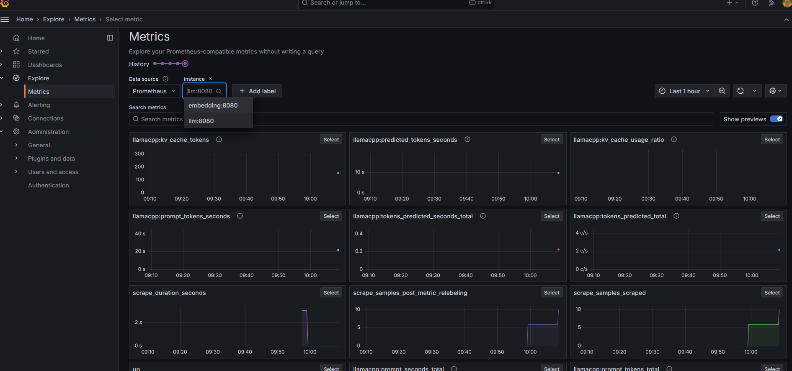

# Minimal RAG Backend with Llama.cpp and Grafana

This repository provides a minimal implementation of a Retrieval-Augmented Generation (RAG) backend. It leverages llama.cpp for inference using both large language models (LLMs) and embedding models. The backend is equipped with Grafana for real-time monitoring and performance visualization. Ideal for developers seeking a lightweight and efficient RAG solution with integrated observability.

## Tech stack

- llama.cpp-server
  - LLM
  - Embedding models
- LiteLLM
  - OpenAI API spec. compatible
- gemma 2 2b
  - https://huggingface.co/phate334/gemma-2-2b-it-Q4_K_M-GGUF/
- multilingual e5 large 
  - https://huggingface.co/phate334/multilingual-e5-large-gguf
  